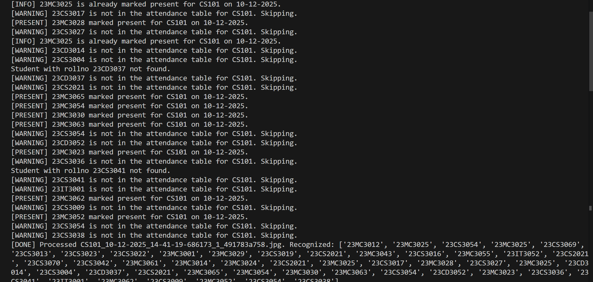

# 🎓 Smart Attendance System using Face Recognition

> **A contactless, automated, and secure attendance management solution leveraging HOG Face Detection and Deep Learning.**

[](https://flutter.dev/)
[](https://flask.palletsprojects.com/)
[](https://www.python.org/)
[](https://www.mysql.com/)

---

## 🌟 Overview

The **Smart Attendance System** automates the traditional attendance process by using computer vision to recognize students from classroom photos. 
Teachers capture a photo via the mobile app, and the backend processes it using **Histogram of Oriented Gradients (HOG)** and **ResNet** to identify students and mark their attendance instantly.

### Why this project?
*   🚫 **Eliminates Proxy Attendance**: Visual verification ensures authenticity.
*   ⚡ **Saves Time**: Marks attendance for an entire class in seconds.
*   📱 **Contactless**: No biometric scanners or physical registers needed.
*   🔔 **Instant Notification**: Students get real-time email confirmation.

---

## 📸 Screenshots

### Mobile Application
| Login Page | Dashboard | Upload Page |
| :---: | :---: | :---: |
|  |  |  |

**Visual Verification & Records**
| Tagged Output (App View) | Attendance Record |
| :---: | :---: |
|  |  |

---

## 📂 Directory Structure

```graphql
attendance_system/
├── Backend/                     # Flask API & Face Recognition Logic
│   ├── model/                   # AI Models & Encoding Scripts
│   │   ├── encode.py            # Script to generate encodings.pkl
│   │   ├── student_encodings.pkl# Generated face encodings (You create this!)
│   │   └── Student Database/    # Folder for student images (Source for encoding)
│   ├── Attendance_Records/      # Stores processed images with bounding boxes
│   ├── Upload_Folder/           # Temp storage for uploaded raw images
│   ├── backend.py               # Main Flask Server
│   ├── requirements.txt         # Python Dependencies
│   └── MySQL Database.sql       # Database Schema Dump
├── Frontend/                    # Flutter Mobile Application
│   ├── lib/                     # Dart Code (UI & Logic)
│   └── pubspec.yaml             # Flutter Dependencies
└── README.md                    # Project Documentation
```

---

## ⚙️ Installation & Setup

### 1. Database Setup 🗄️
The system requires a MySQL database.
1.  Open your MySQL Workbench or Command Line.
2.  Create a new schema/database (e.g., `attendance_db`).
3.  **Import the provided SQL file**:
    *   Run the `Backend/MySQL Database.sql` script to create all necessary tables (`Teacher`, `Student`, `Teacher_Subject`, etc.).
    *   *Note: This script outlines the schema structure.*

### 2. generating Face Encodings 🧠
**Important**: You must generate the `student_encodings.pkl` file using your own student images.

1.  Navigate to the model directory:
    ```bash
    cd Backend/model
    ```
2.  **Prepare Images**:
    *   Create a folder named `Student Database` inside `Backend/model/`.
    *   Add student photos named as `RollNo.jpg` (e.g., `22IT3025.jpg`).
3.  **Run the Encoding Script**:
    ```bash
    python encode.py
    ```
    *   ✅ *Output*: This will create `student_encodings.pkl` in the same folder.

### 3. Backend Setup 🐍

1.  Navigate to the `Backend` root directory:
    ```bash
    cd ../
    ```
2.  Create and activate a virtual environment:
    ```bash
    python -m venv venv
    # Windows:
    .\venv\Scripts\activate
    # Mac/Linux:
    source venv/bin/activate
    ```
3.  Install dependencies:
    ```bash
    pip install -r requirements.txt
    ```
4.  **Configure Environment**:
    *   Create a `.env` file in `Backend/` with your credentials:
        ```env
        DB_HOST=localhost
        DB_USER=root
        DB_PASSWORD=your_password
        DB_NAME=attendance_db
        EMAIL_USER=your_email@gmail.com
        EMAIL_PASS=your_app_password
        ```
5.  Start the Server:
    ```bash
    python backend.py
    ```
    *   *Server will start at `http://0.0.0.0:5000`*

    **Sample Server Output:**
    

### 4. Frontend Setup 📱

1.  **Create a New Flutter Project**:
    *   Open your terminal/command prompt.
    *   Initialize a new project (e.g., `attendance_app`):
        ```bash
        flutter create attendance_app
        ```
2.  **Integrate Source Code**:
    *   Go to your new project folder: `cd attendance_app`.
    *   **Delete** the existing `lib` folder and `pubspec.yaml` file.
    *   **Copy** the `lib` folder and `pubspec.yaml` file from the provided `Frontend/` directory into your new project root.
3.  **Install Dependencies**:
    ```bash
    flutter pub get
    ```
4.  **Configure API URL**:
    *   Create a `.env` file in the root of your Flutter project (`attendance_app/.env`).
    *   Add your machine's local IP address (ensure your phone/emulator is on the same network):
        ```env
        SERVER_URL=http://<YOUR_IPV4_ADDRESS>:5000
        ```
5.  **Run the App** (Ensure an emulator or device is connected):
    ```bash
    flutter run
    ```

---

## 👥 Team Members (Group IT-3)

| Name | Roll No | Role | Contribution |
| :--- | :--- | :---: | :--- |
| **Naresh Kumar** | 22IT3025 | **Team Lead** | Project Mgmt, System Integration |
| **Anushka Nema** | 22IT3008 | **AI Engineer** | Face Recognition Model |
| **Krishna Goyal** | 22IT3021 | **Backend Dev** | Flask API & Server Logic |
| **Nikhilesh Raj Singh** | 22IT3026 | **App Dev** | Flutter UI & API Integration |
| **Kriti Mehrotra** | 22IT3022 | **Security Eng.** | Auth & Password Hashing |
| **Suruchi Kumari** | 22IT3056 | **DB Admin** | Schema & Query Optimization |
| **Srishti Tripathi** | 22IT3055 | **QA Engineer** | Testing & Validation |

---

*Submitted to the Department of Computer Science & Engineering, Rajiv Gandhi Institute of Petroleum Technology.*
